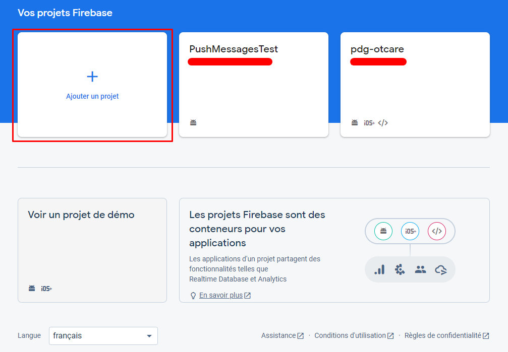
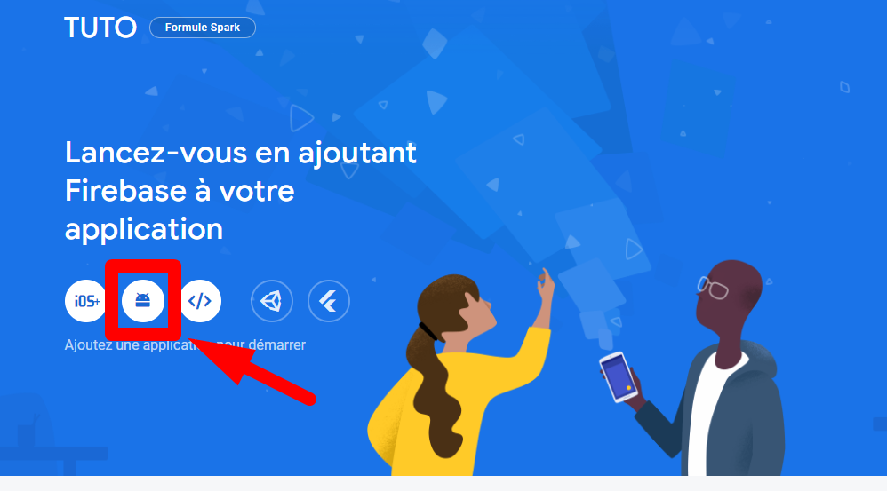
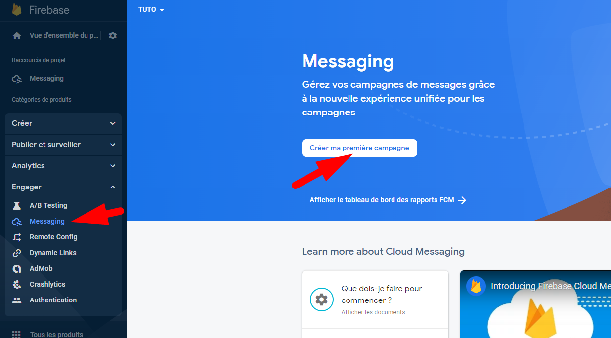
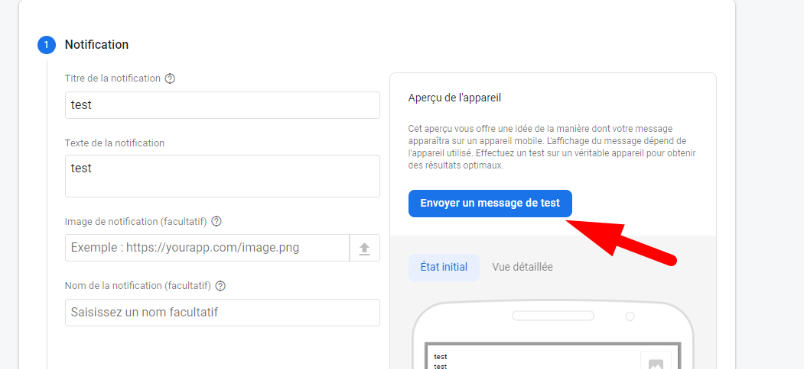
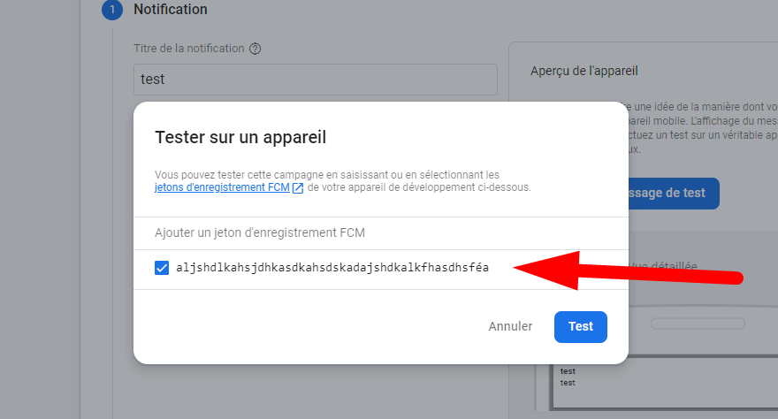
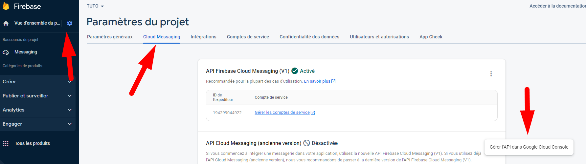

# Android message push

## But

Les messages push sont des messages envoyés par un serveur à un appareil mobile via une connexion Internet, même lorsque l'application n'est pas en cours d'exécution. Ils permettent notamment de notifier une application de la réception d'un message, ce qui peut conduire, par exemple, à l'affichage d'une notification de l'application pour stimuler les utilisateurs.

Les notifications push ont été lancées pour la première fois en 2009 par Apple avec le "Apple Push Notification Service" et ont été introduites par Google en 2010 avec "Google Cloud to Device Messaging". Ce service a ensuite été fermé en 2015 pour être remplacé par Firebase cloud messaging.

Il est important de noter que les smartphones Android ont l'obligation d'avoir le service de Google installé (Google play service), sans quoi la communication push ainsi que l'utilisation de tous les autres services proposés par Firebase ne sont pas possible. Cependant, il est fréquent de retrouver des modèles/marques de smartphones, principalement en Asie, qui ne posssèdent pas ce service. Il est donc nécessaire trouver une autre manière d'envoyer des messages push, mais cela pose souvent des problèmes de fonctionnement, en raison des restrictions appliquées dans le but d'économiser la batterie.

Les messages push offrent un connexion constamment ouverte et permettent aux applications d'y faire transiter leurs messages. Comme ce service est en constante écoute, l'application est rapidement réveillée lorsque le smartphone reçoit un message lui étant destiné. Tous les messages transitent obligatoirement par un serveur Firebase. 

## Les problématiques qu’ils peuvent résoudre

Un avantage non négligeable de ce service est le fait qu'il soit gratuit, ce qui permet à quiconque d'implémenter une communication entre un serveur et son application sans le moindre frais.

Il permet également de réduire la consommation de batterie. En effet, si chaque application du smartphone contenait une tâche de fond devant maintenir une connexion TCP afin d'attendre sur la réception d'un message, la batterie ne tiendrait pas longtemps. Ce service est donc unique sur le smartphone, oblige toutes les applications à passer par lui, et se charge simplement de réveiller les applications qui doivent réaliser certaines tâches (réception d'un message). Il devient par conséquent laborieux de réaliser une application avec un système similaire aux messages push, mais sans utiliser les services de Firebase. C'est notamment causé par le fait qu'Android cherche constamment à optimiser le système et qu'il détruit par conséquent la moindre tâche qu'il ne juge pas nécessaire. Un tâche jugée pas assez utile ou trop gourmande par l'appareil ne sera donc jamais exécutée. De plus, il est obligatoire, dans ce cas, d'afficher une notification pour avertir à l'utilisateur qu'une application tourne en fond et consomme donc la batterie.

## Alternatives

Il n'existe pas réellement d'alternatives car tous les autres services passeront par Firebase pour afficher les messages push. Ce que les "alternatives" proposent consiste souvent uniquement en une meilleure interface et analyse des données.

## Comment est-ce qu’ils s'utilisent

Les étapes suivante sont tirées de cette documentation : https://firebase.google.com/docs/android/setup

1.  Ajouter Firebase à son application

    -   Dans votre fichier Gradle au niveau de la racine (au niveau du projet) ( \<project>/build.gradle ), ajoutez le plug-in de services Google en tant que dépendance buildscript :

    ```Gradle
    buildscript {

     repositories {
       // Make sure that you have the following two repositories
       google()  // Google's Maven repository
       mavenCentral()  // Maven Central repository
     }

     dependencies {
       ...

       // Add the dependency for the Google services Gradle plugin
       classpath 'com.google.gms:google-services:4.3.14'
     }
    }
    ```

    -   Dans le fichier Gradle de votre module (au niveau de l'application) (généralement \<project>/\<app-module>/build.gradle ), ajoutez le plug-in de services Google :

    ```Gradle
    plugins {
    id 'com.android.application'

    // Add the Google services Gradle plugin
    id 'com.google.gms.google-services'
    ...
    }
    ```

    -   Dans le fichier Gradle de votre module (au niveau de l'application) (généralement \<project>/\<app-module>/build.gradle ), ajoutez les dépendances des produits Firebase que vous souhaitez utiliser dans votre application. Il est recommandé d'utiliser Firebase Android BoM pour contrôler la gestion des versions de la bibliothèque.

    ```Gradle
    dependencies {
    // ...

    // Import the Firebase BoM
    implementation platform('com.google.firebase:firebase-bom:31.1.1')

    // When using the BoM, you don't specify versions in Firebase library dependencies

    // Add the dependency for the Firebase Cloud Messaging
    implementation 'com.google.firebase:firebase-messaging-ktx'

    }
    ```

    -   Il reste ensuite à ajouter les fichiers de configuration firebase que nous allons ajouter à la prochaine étape.

2.  Créer un projet Firebase
    -   Pour pouvoir utiliser Firebase, il est nécessaire de vous créer un compte afin d'accéder à cette page: https://console.firebase.google.com/
    -   Maintenant que vous avez accès à la console, créez un nouveau projet:

        <p align="center">
        
        </p>
        
    -   Saisissez le nom de votre projet, puis cliquez sur "continuer" 2x et choisissez le compte que vous souhaiter utiliser pour les Google Analytics. Vous aurez maintenant accès à la console de votre projet. Depuis cette console, il est possible d'utiliser les différents services que propose Firebase.
    -   Il faut maintenant importer la configuration dans notre projet Android. Pour cela, cliquez sur l'icone android sur la page d'acceuil.
    
    <p align="center">
    
    </p>
    
    -   Remplissez à présent les champs obligatoire demandé durant l'assistant de configuration. Veillez à mettre un nom de package qui correspond bien à celui de votre application.
    -   Téléchargez le fichier google-services.json et mettez le dans le dossier `./app/` de votre projet. Il permet à votre application de communiquer avec votre projet firebase.
    -   Vous pouvez ensuite sauter les étapes d'après car nous l'avons déjà fait dans la première partie.
3.  Ajouter un service Cloud Messaging à son application
    Nous allons maintenant ajouter le service qui va être utilisé pour réagir aux messages push. Pour cela nous allons ajouter ces lignes à l'intérieur du tag `\<application>` dans notre fichier manifest se trouvant dans `./app/src/main/AndroidManifest.xml`

    ```xml
    <service
        android:name=".MyService"
        android:exported="false">
        <intent-filter>
            <action android:name="com.google.firebase.MESSAGING_EVENT" />
        </intent-filter>
    </service>
    ```

    Veuillez noter que `MyService` correspond à la classe que l'on va utiliser.
    Vous remarquerez aussi que l'on ajoute une intention qui est que lors de la récéption d'un message venant de firebase le service doit être reveillé.

    Maintenant il faut que l'on ajoute la classe MyService, pour ce faire ajoutez les lignes suivante dans un fichier `app\src\main\java\com.domaine.nom\MyService.kt`.

    ```kotlin
    class MyService : FirebaseMessagingService() {
        override fun onNewToken(token: String) {
            super.onNewToken(token)
            Log.i("MYTAG", token)
        }


        override fun onMessageReceived(message: RemoteMessage) {

            if(message.data["test"] != null){
                Log.i("MYTAG", message.data["test"].toString())
                return super.onMessageReceived(message);
            }

            val title: String = message.notification?.title.toString()
            val text: String = message.notification?.body.toString()

            Log.i("MYTAG", title)
            Log.i("MYTAG", text)

            super.onMessageReceived(message)
        }
    }
    ```

    Dans le code ci-dessus la fonction onNewToken est d'utiliser pour récupérer le token permettant d'identifier votre appareil. Ce token peut être renouvelé dans certains cas. Ce token est utile lorsque vous souhaitez cibler un appareil en particulier.

    La fonction onMessageReceived est appelée lors de la récéption d'un nouveau message. Que votre application soit ouverte, en arrière plan ou alors fermée cette fonction sera toujours appelée. En réalité, il existe deux type de messages push, les data messages et les notifications push. Le fonctionnement décrit précédemment est vrai dans le premier cas. En revanche lors du deuxième cas la fonction `onMessageReceived` ne sera appelée que lorsque l'application est ouverte. Cela vous permet de décider comment vous souhaitez afficher cette notification. Les notifications push ne sont pas gérées par cette fonction lorsque votre application est en arrière plan ou fermée, une notification est tout simplement affichée sur le téléphone.

    Vous trouverez plus de détails à propos de cette classe sur cette page: https://firebase.google.com/docs/reference/android/com/google/firebase/messaging/FirebaseMessagingService

    Veuillez noter que si vous développez pour Android 13, il est nécessaire de demander l'autorisation d'afficher des notifications.

4.  Envoyer les messages push

    Il existe donc deux types de messages push, les notifications push et les data messages.
    Vous pouvez planifiez des notifications à l'aide de la console Firebase très facilement.
    <p align="center">
    
    </p>
    
    Vous pourez ensuite choisir le type de notification que vous souhaitez ainsi que le contenu de cette dernière.

    Il vous sera aussi possible de tester votre notification avant de la mettre en "production".
    <p align="center">
    
    
    </p>
    
    Le token à ajouter correspond à celui que vous pouvez récupérer dans la fonction onNewToken que nous avons créé dans l'étape précédente.

    En revanche pour envoyer les data messages, il n'existe malheureusement aucune interface pour cela. Il vous faut donc utiliser le sdk firebase via une autre application ou alors utiliser une requête http.

    Pour ce tuto, nous allons le faire à l'aide d'une requête http.
    Rendez-vous dans les paramètres de la console Firebase puis dans l'onglet Cloud Messaging et cliquez sur Gérer l'API pour pouvoir l'activer.
    
    <p align="center">
    
    </p>

    Retournez maintenant dans l'onglet Cloud Messaging et notez la clé du serveur.

    Vous pouvez à présent envoyer un data message par une requête post:

    header:

    -   `Content-Type: application/json`
    -   `Authorization: key=\<clé-serveur>`

    body:

    ```json
    {
        "data": {
            "test": "coucou"
        },
        "to": "target-token"
    }
    ```

## limitations

-   Certains constructeurs n'hésitent pas à restreindre les applications dans le but de faire durer la batterie plus longtemps, par conséquent il est possible que les notifications/messages ne soient pas reçus par l'application.
-   La taille des messages est limité

## points à retenir
- Pour fonctionner les messages push garde une connexion constamment ouverte avec firebase.
- 2 types de Message Push: Data et notification
- Les alternatives sont obligées de passer par les serveurs de firebase pour que cela fonctionne correctement.
- Le Smartphone doit posséder les services Google Play pour que cela marche.
